# Snap-to-3D: Multi-View Object Reconstruction from Smartphone Images

<p align="center">
  <a href="https://final-project-snap-3d.github.io/snap-to-3d.github.io/">
    
  </a>
</p>
<p align="center">
  <sub>📖 Prefer a friendlier, visual walkthrough? Everything in this README is also presented as an interactive site → <a href="https://final-project-snap-3d.github.io/snap-to-3d.github.io/"><b>final-project-snap-3d.github.io</b></a></sub>
</p>

> Final project — Postgraduate course on **Artificial Intelligence with Deep Learning**, UPC School (2026)
>
> **Authors:** Maria Bertolín · Marc Borràs · Marc Castellana · Gerard Rosell
>
> **Advisor:** Pablo Vega
>
> **Repository:** https://github.com/Final-Project-Snap-3D/SegmentationModel_PP_AI

---

## TL;DR

> **Snap-to-3D** turns a handful of casual smartphone photos into a **Blender-ready, 3D-printable mesh** (`.obj` / `.ply`) — no scanner, turntable, or calibration rig.
>
> **How it works:** two branches run **in parallel** on the same shots. **Segmentation** (YOLO26-seg fine-tuned on VizWiz — **0.89 IoU / 0.92 Dice**) isolates the object, while **VGGT-Ω**, a feed-forward transformer, recovers camera poses and a dense **depth map + per-pixel confidence** in a single pass. The mask zeroes the depth confidence *before* unprojection, so the point cloud is **born object-only**; **PyMeshLab** (screened Poisson) then turns it into a watertight mesh. The whole pipeline is served by a **FastAPI** backend consumed by a **mobile app**.

---

## Table of Contents

1. [Introduction & Motivation](#1-introduction--motivation)
2. [Pipeline Overview](#2-pipeline-overview)
3. [Dataset](#3-dataset)
4. [Segmentation](#4-segmentation)
5. [3D Reconstruction](#5-3d-reconstruction)
6. [End-to-End System](#6-end-to-end-system)
7. [Repository Structure](#7-repository-structure)
8. [How to Run](#8-how-to-run)
9. [Summary of Key Decisions](#9-summary-of-key-decisions)
10. [Conclusions & Future Work](#10-conclusions--future-work)

---

## 1. Introduction & Motivation

Snap-to-3D is an end-to-end pipeline that turns a handful of casual smartphone photos of a real-world object into a **Blender-ready, editable, 3D-printable mesh** (`.obj` / `.ply`). No turntable, no scanner, no calibration rig — just a few shots taken from different angles.

The goal is to make 3D asset creation accessible to anyone with a phone. Concrete applications:

- **E-commerce** — generate 3D product views from a quick photo session.
- **Digital twins** — capture physical assets for simulation or inventory.
- **Cultural heritage** — digitize objects for preservation and study.
- **3D printing** — produce watertight meshes ready to slice and print.

---

## 2. Pipeline Overview


At a high level, the input photos fan out into **two branches that run in parallel** on the same frames. **VGGT-Ω** recovers, in a single forward pass, every view's camera (**extrinsics + intrinsics**) and a dense **depth map with a per-pixel confidence** — not a point cloud yet. **Segmentation** isolates the object as a **binary mask** per view. The two branches converge at the **mask filter**, which zeroes the depth confidence *outside* the object (`C' = C · M`) **before any 3D point exists**. Only the surviving, object-only pixels are then **unprojected** into one shared world frame to build the point cloud, which **PyMeshLab** turns into a watertight mesh (screened Poisson) and exports as `.obj` / `.ply`.

```
Smartphone photos (N views · RGB · background kept)
        │
        ├─────► Segmentation ─────► binary masks ───────────────────┐
        │       (YOLO26-seg + opening + keep-largest)               │
        │                                                           ▼
        └─────► VGGT-Ω ─────► depth maps + per-pixel confidence ─► mask filter ─► unprojection ─► PyMeshLab ─► .obj/.ply
```

Because the mask is applied to the **depth confidence** — not to a finished cloud — the point cloud is *born* object-only: no background geometry is ever built and then discarded. **Unprojection** is textbook pinhole back-projection (`x = (u − cx)/fx · d`, then camera → world via `Rᵀ`), carrying each pixel's RGB colour, dropping depth-edge *flying pixels*, keeping the top confidence percentile (~80 %) and capping at **≤ 300k points** before meshing — see §5 and §6.2 for the full treatment.

---

## 3. Dataset

We train the segmentation stage on **[VizWiz](https://vizwiz.org/tasks-and-datasets/salient-object-detection/)**, a dataset of 32 000 photos taken by blind and low-vision users. Its *real-world mobile captures* — noisy, with diverse lighting, cluttered backgrounds, motion blur, and off-center framing — closely match the conditions our pipeline must handle, making it a far better fit than clean studio datasets. Two additional characteristics shape the learning task: 68 % of images contain text overlaid on the salient object, and the salient object typically occupies a large portion of the frame.

Annotations are provided as one JSON per split (`VizWiz_SOD_{train,val,test}_challenge.json`), where each entry gives the ground-truth image dimensions and a list of `Salient Object` polygons. Polygons are rasterized into binary masks with `cv2.fillPoly`; images without a valid annotation are filtered out automatically.

```json
"VizWiz_train_00000000.jpg": {
    "Full Screen": false,
    "Total Polygons": 1,
    "Ground Truth Dimensions": [H, W],
    "Salient Object": [[[x1, y1], [x2, y2], ...]]
}
```

The split is **not** produced by our code (no random split): we use the official VizWiz SOD train/val/test challenge splits directly, defined by the three JSON files above and their matching `data/{train,val,test}` image folders.

| Split | Images |
|-------|--------|
| Train | 19.116|
| Val   | 6.105 |
| Test  | 6.779 |
| **Total** | 32.000 |

---

## 4. Segmentation

### 4.1 Models

We iterated through three architectures.

**1. UNet from scratch.** Trained on VizWiz with a combined `BCEDiceLoss` (0.3 BCE + 0.7 Dice), `AdamW` optimizer (lr `1e-3`), 512×512 inputs, and Albumentations augmentation (horizontal flip, rotations, shift-scale-rotate, brightness/contrast, hue/saturation, blur, noise). BatchNorm was added between Conv and ReLU to stabilize training from zero. Training was made on a Google Engine VM. **Results were not satisfactory** — masks were imprecise and unstable.

**2. U²-Net.** Switching to the U²-Net architecture (nested RSU blocks with deep supervision over 6 side outputs) produced a **dramatic improvement** over UNet. Object boundaries were far cleaner, though some segmentation errors remained. This is the default model in `src/main.py` (`--model_name U2`). The training started on the Google Engine VM but progressed very slowly.

**3. YOLO (Ultralytics YOLO26-seg).** With limited time and team resources, we fine-tuned YOLO26-seg on VizWiz (single class `salient_object`) for instance segmentation. Results were **cleaner** and more robust on our target images.

> Note: Segmentation must use the **VizWiz-fine-tuned** YOLO checkpoint produced by `src/train_yolo.py`.

Metrics on the **VizWiz SOD test split** (`VizWiz_SOD_test_challenge.json`), pixel-level, same evaluation script (`src/test_evaluation.py`); binarization threshold 0.5 for UNet/U²-Net, YOLO confidence 0.25.

| Model | IoU | Dice | Precision\* | Recall\* |
|-------|-----|------|-----------|--------|
| UNet (scratch) | 0.62011 | 0.73052 | - | - |
| U²-Net | 0.7765 | 0.8397 | 0.8366 | 0.8987 |
| **YOLO26-seg (fine-tuned)** | **0.8866** | **0.9206** | **0.9057** | **0.9584** |

YOLO26-seg wins on every metric (+0.110 IoU / +14.2 %, +0.081 Dice over U²-Net) — hence our final segmenter, with U²-Net kept as the baseline. Both models keep recall above precision, i.e. they slightly over-segment (include a little background rather than dropping object pixels) — the preferable failure mode for the VizWiz use case.

> **\* On Precision and Recall.** These two are each reported at the model's *own* operating point — binarization threshold 0.5 for UNet/U²-Net, confidence 0.25 for YOLO — and, for YOLO, after merging its per-instance masks into a single foreground mask. They are therefore *indicative* rather than measured at a matched operating point, and are far more threshold-sensitive than IoU/Dice (a lower threshold trades precision for recall and vice versa). UNet's were not logged. A unified, threshold-matched evaluation (precision–recall curves at a common operating point) is left as **future work** — see §10.

Images: 
Masks with U2Net: 
Masks with YOLO: 

### 4.2 Mask Refinement

Both YOLO and U²-Net locate the object reliably, but they fail in different ways: YOLO occasionally adds **spurious secondary detections** (other objects in the scene), while U²-Net produces **soft, blob-like boundaries** with small holes and specks. Refinement removes this noise *before* the mask filters the point cloud, so background geometry doesn't leak into the final mesh.

Our segmentation module (`vggt_omega/segmentation.py`) provides a toolbox that can be combined:

- **AND combination (mixed mode).** Element-wise AND of the YOLO and U²-Net binary masks — a pixel is kept only if *both* models agree it is foreground. This cancels each model's false positives, but erodes the object wherever the two disagree.
- **Morphological opening** (`--morph-open`; elliptical kernel, `--morph-kernel`, default 21). Erosion followed by dilation: removes small noise regions and thin bridges while leaving the main compact object intact.
- **Keep-largest component** (`--keep-largest`). Connected-component analysis (8-connectivity) that keeps only the largest region per frame, discarding secondary detections (e.g. a background object caught alongside the target).

#### What is a morphological opening?

A morphological *opening* is **erosion followed by dilation** with the same structuring element (here an elliptical kernel of side `--morph-kernel`, default 21). The two operations slide that kernel over the binary mask:

- **Erosion** turns a pixel on **only if the whole kernel fits inside the foreground**. It strips a border layer off every region, deletes specks, and severs thin bridges between blobs.
- **Dilation** is the dual: a pixel turns on if **any** foreground pixel falls under the kernel. It regrows that border layer.

Applied in that order, the main object shrinks and then grows back to (roughly) its original size, but anything **thinner than the kernel** — specks, 1-pixel bridges, ragged edges — is erased by the erosion and has nothing left to regrow from during dilation. This lets us erase any unwanted small clusters of pixels related to background objects. A worked 3×3 example (`█` = object, `·` = background):

```
        Original                After erosion             After dilation  =  OPENING
   (block + a stray speck)     (border stripped,          (block restored,
                                speck & thin bits gone)     speck stays gone)
   · · · · · · ·               · · · · · · ·               · · · · · · ·
   · █ █ █ █ · ·               · · · · · · ·               · █ █ █ █ · ·
   · █ █ █ █ · █   ← speck     · · █ █ · · ·               · █ █ █ █ · ·
   · █ █ █ █ · ·               · · · · · · ·               · █ █ █ █ · ·
   · · · · · · ·               · · · · · · ·               · · · · · · ·
```

The isolated speck is smaller than the kernel, so erosion wipes it out permanently; the solid block loses its outer ring to erosion but dilation restores it. A large kernel (21) is deliberately aggressive: it clears sizeable spurious regions and thick bridges, keeping only the main compact object.

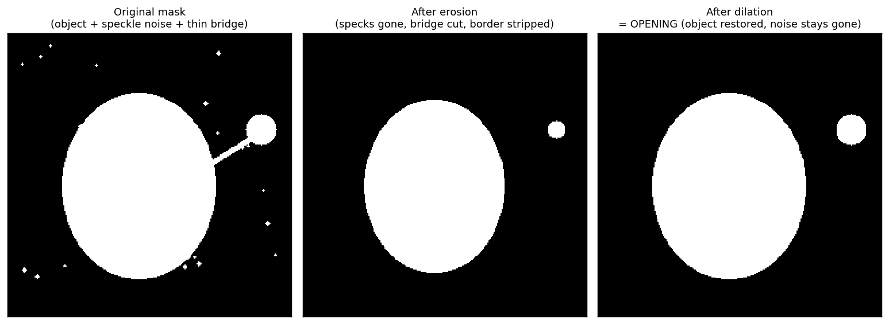

The same idea on a real 2D mask (illustrative). Note the secondary blob on the right: opening only cuts the **thin bridge** joining it to the object — the blob itself is larger than the kernel, so it survives. That is exactly why **keep-largest** runs next: once opening has disconnected the noise, connected-component analysis drops the now-isolated secondary region and leaves only the main object.

We compared three refinement approaches on the same captures:

| Approach | What it does | Result |
|----------|--------------|--------|
| **A** — YOLO ∩ U²-Net (AND) | Intersect both masks | Removes false positives, but erodes edges where the two models disagree |
| **B** — U²-Net + opening | Saliency mask cleaned with morphological opening | Clean silhouette, but softer / less precise boundaries |
| **C** — YOLO + opening | Detection mask cleaned with morphological opening | **Selected** — sharp boundaries, residual noise removed, object not eroded |

<table>
  <tr>
    <td align="center">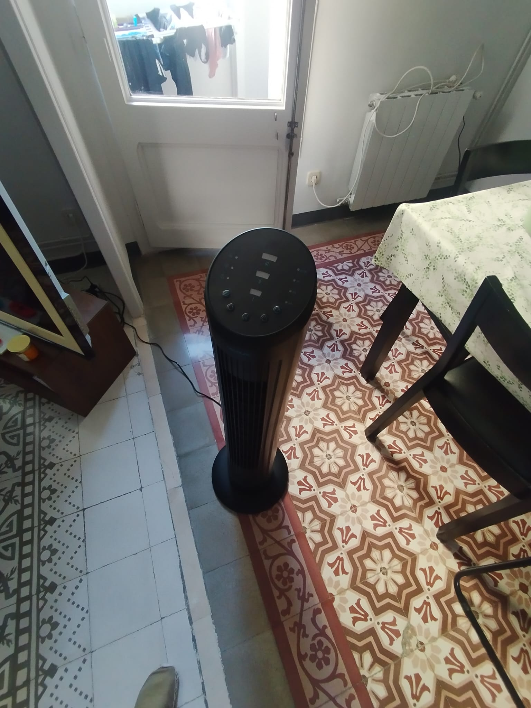<br/><sub><b>img_base.jpeg</b><br/>Input image</sub></td>
    <td align="center">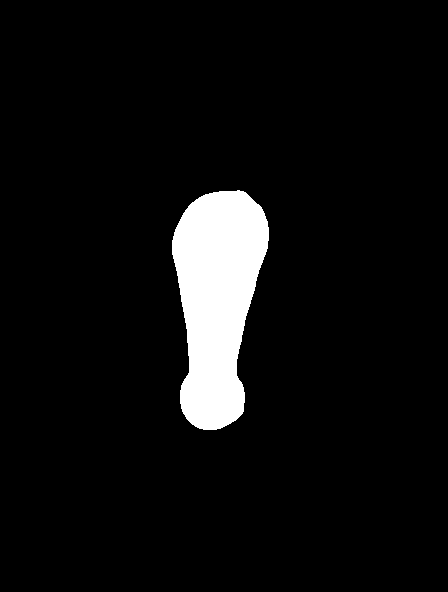<br/><sub><b>mask_003_mix.png</b><br/>A — YOLO ∩ U²-Net</sub></td>
    <td align="center">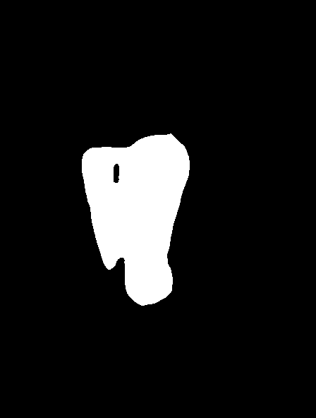<br/><sub><b>mask_003_u2.png</b><br/>B — U²-Net + opening</sub></td>
    <td align="center"><br/><sub><b>mask_003_yolo.png</b><br/>C — YOLO + opening ✓</sub></td>
  </tr>
</table>

The chosen configuration is **Approach C** (`--seg-checkpoint <yolo_vizwiz>.pt --morph-open --keep-largest`).

---

## 5. 3D Reconstruction

### 5.1 VGGT-Ω

For pose estimation and reconstruction we use [**VGGT-Ω** (CVPR 2026, VGG Oxford + Meta AI)](https://vggt-omega.github.io), a feed-forward transformer that recovers camera geometry and dense 3D **in a single forward pass** — no iterative feature matching and no bundle adjustment. We chose it over **COLMAP** because incremental SfM is slow, brittle on sparse or textureless captures, and often fails on casual phone photos; VGGT-Ω stays robust even with very few views.

**General input / output**

- **Input:** N RGB images of the object *with their background* (JPG/PNG and phone **HEIC/HEIF** via `pillow-heif`; preprocessed to `(N, 3, H, W)`, resolution 512; mixed portrait/landscape is padded to a common size). The background is required — it gives the geometric context the model needs for pose estimation.
- **Output:** for each view, camera **extrinsics** (rotation + translation) and **intrinsics** (`K`), a dense **depth map** and a per-pixel **confidence**; from these, a fused dense **point cloud** in world coordinates.

**How it works — stage by stage**

| # | Stage | Input | Output |
|---|-------|-------|--------|
| 1 | **Image tokenizer** (DINOv3 `patch_embed`) | `(N,3,H,W)` RGB images | Patch tokens per image |
| 2 | **Aggregator** — alternating **frame-wise** and **global cross-view** attention, with learned **camera** and **register** tokens | Patch tokens + camera/register tokens | Context-aware tokens shared across all views (`camera_and_register_tokens` + patch features) |
| 3 | **Camera head** | Camera tokens | Pose encoding → **extrinsics** + **intrinsics** per view |
| 4 | **Depth head** | Aggregated patch features | Dense **depth map** + **depth confidence** per view |
| 5 | **Unprojection** (post-processing) | Depth + intrinsics + extrinsics | **3D point cloud** in world coordinates, confidence-filtered |

The core idea is the **alternating attention** in the aggregator: frame-wise attention refines each image on its own, while global attention lets all views exchange information, so the model settles on a single consistent geometry and camera set instead of solving each image independently. The **camera tokens** specialize in recovering pose, and the **register tokens** absorb global context that stabilizes the features. The **depth confidence** from stage 4 is later used to drop unreliable points before meshing (and is where the segmentation mask is applied — Option C, see §6.2).

> ⚠️ VGGT-Ω requires a **CUDA GPU** 


#### Interactive demo (Gradio)

The VGGT-Ω team hosts an interactive **[Gradio](https://www.gradio.app/)** demo as a **Hugging Face Space** ([`facebook/vggt-omega`](https://huggingface.co/spaces/facebook/vggt-omega)), which we used to inspect our reconstructions: you upload a handful of images, it runs a **single forward pass** on their GPU, and renders the result in the browser — nothing to install or run locally.

**What you see.** The 3D viewer shows two things at once, both recovered in the same forward pass:

- **The dense point cloud** — the fused, colored 3D reconstruction, unprojected from the per-view depth maps.
- **The estimated cameras** — one small **frustum (pyramid)** per input photo, placed at the exact position and orientation VGGT-Ω predicted for it (the extrinsics `[R | t]`). The apex sits at the camera centre and the pyramid opens along the viewing direction, so you can literally see *from where* and *at what angle* each shot was taken; together they trace the arc walked around the object.

You can **orbit, zoom and pan** the scene, filter points by **depth confidence**, cap the number of points, and toggle the cameras or background on/off — useful to check that the poses are consistent and the geometry lines up before segmentation and meshing.

**Intrinsics vs extrinsics.** Each frustum encodes the two sets of parameters VGGT-Ω predicts for that view:

- **Extrinsics `[R | t]` — *where the camera is*.** The rotation `R` (which way it points) and translation `t` (its position) in the shared world frame. This is exactly what places and orients each pyramid in the demo: the arc of frustums *is* the extrinsics of all the shots.
- **Intrinsics `K = [fx, fy, cx, cy]` — *the camera's internal optics*.** The focal lengths `fx, fy` (in **pixels** — roughly how many pixels span the field of view) and the principal point `cx, cy` (the optical centre on the image). They set the **opening angle of the frustum** (longer focal length → narrower pyramid → more zoomed-in view) and are what turn a pixel + its depth into a 3D ray during unprojection (see §6.2.2).

So the extrinsics say *from where* each photo was taken and the intrinsics say *how* its lens maps the world onto pixels — and it's the two together that let every view's points land in one consistent cloud.


### 5.2 Point Cloud to Mesh

All Poisson methods build the surface by fitting an implicit function to the points and their **normals** (the direction each point faces), then extracting it with Marching Cubes. What changes between them is **how tightly the surface is pinned to the actual points**:

**1. Poisson (unscreened).** Solves Δχ = ∇·V — it follows only the normals, not the point positions. Where data is thin (e.g. the object's back seen from few views) the surface drifts off the points: it either balloons outward or, once the low-support parts are trimmed away, tears a **hole**. Open3D `create_from_point_cloud_poisson`. Kept as baseline/fallback.

**2. NKSR.** Swaps the fixed B-spline basis for a **learned neural kernel field** fit to the oriented points (`nksr.Reconstructor.reconstruct`). Promising but not integrable in time (expired wheels, source CUDA build).

**3. Screened Poisson (PyMeshLab) — final choice.** Same idea **plus one extra term** α·Σ(χ(pᵢ) − c)² that also forces the surface to pass through the points themselves. So it stays glued to the object — no drift, no holes, sharper detail. `generate_surface_reconstruction_screened_poisson(depth=9)`.

| Method | Surface pinned to points | Outcome |
|--------|--------------------------|---------|
| Poisson | ✗ (normals only) | Drifts → balloons or holes on few-view clouds |
| NKSR | learned kernels | Not integrable in time |
| **Screened Poisson** | ✓ | **Selected — glued to object, sharp, watertight** |

**Conversion steps.**

```
Point cloud ─►[1] conf. filter ─►[2] outlier removal ─►[3] normals (PCA + MST)
            ─►[4] Screened Poisson (Δχ=∇·V + screening, octree d=9 → Marching Cubes)
            ─►[5] density trim ─►[6] cleanup + color ─► watertight mesh (.obj/.ply)
```

Steps **1–3 condition** the cloud: drop low-confidence points, remove statistical outliers (mean *k*-NN distance > μ + λσ), and estimate normals by local PCA (normal = eigenvector of least variance) oriented consistently via a minimum-spanning tree — Poisson needs oriented normals. Step **4** reconstructs. Step **5 trims** vertices below the ~5 % sample-density quantile, cutting extrapolated back-face bubbles. Step **6** removes degenerate/duplicate/non-manifold elements and transfers per-vertex color from the nearest point. Steps 1–3, 6 use **Open3D**; 4–5 use **PyMeshLab** (falls back to Open3D Poisson if unavailable).

**Input:** point cloud from VGGT-Ω. 


**Output:** watertight, colored `.obj` / `.ply` mesh.

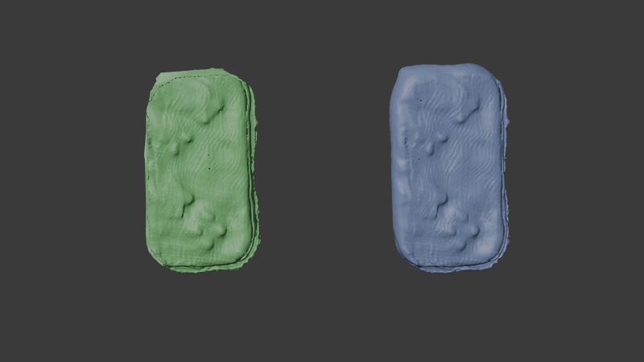

*Green: Poisson / Blue: Screened Poisson

---

## 6. End-to-End System

### 6.1 API Architecture

Inference is served through a **FastAPI** application (`vggt_omega/api/main.py`) that exposes the pipeline as an HTTP service. Full spec in [`vggt_omega/api/API_SPEC.md`](vggt_omega/api/API_SPEC.md).

Endpoints:

| Method & path | Purpose |
|---------------|---------|
| `POST /api/v1/inference` | Upload N images and run the pipeline; returns job metadata + artifact download URLs |
| `GET /api/v1/jobs/{job_id}/files/{path}` | Download a single artifact (mesh, point cloud, depth/mask PNG) |
| `GET /api/v1/jobs/{job_id}/archive` | Download all artifacts of a job as a ZIP |
| `GET /health` | Device, CUDA and checkpoint availability |
| `GET /docs` | Interactive Swagger UI |

The `inference` endpoint accepts (multipart form): `images[]`, `export_format` (`mesh`/`points`), `mesh_format` (`obj`/`stl`/`ply`), `segment`, `seg_conf`, `export_depth`, `export_masks`, plus preprocessing knobs (`resolution`, `mode`, `conf_thres`, `poisson_depth`). It returns a JSON with `job_id`, `num_images`, `device`, tensor `shapes`, an `artifacts` list and an `archive_url`. Inference is serialized behind a lock (single shared GPU); uploads are limited to 32 images / 25 MB each, and the service returns `503` on CPU-only hosts.

Configuration is environment-driven (`vggt_omega/api/constants.py`): checkpoints are looked up in `checkpoints/` first, then the repo root.

**Mobile application.** The API is consumed by a mobile client: the user photographs the object from several angles, the app posts the images to `POST /api/v1/inference`, and receives the reconstructed 3D object (point cloud / mesh) as the result. The multipart service decouples the app from the GPU server, so all heavy inference stays server-side. The mobile app is developed in a separate repository: [`Final-Project-Snap-3D/FE_APP_PP_AI`](https://github.com/Final-Project-Snap-3D/FE_APP_PP_AI).

The same flow as seen in the **mobile client** — *frontend → backend → frontend*:

<table>
  <tr>
    <td align="center">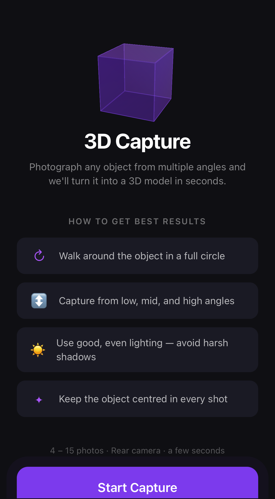<br/><sub><b>1 · Capture</b> · frontend<br/>The user shoots N views of the object</sub></td>
    <td align="center">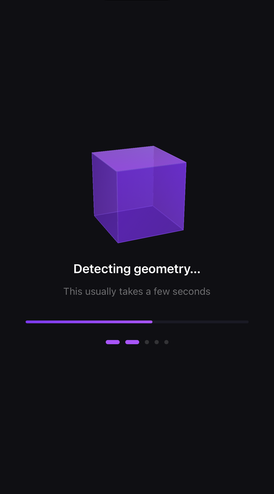<br/><sub><b>2 · Compute</b> · backend<br/>Images POSTed to <code>/api/v1/inference</code>; the GPU server runs VGGT-Ω&nbsp;+&nbsp;segmentation&nbsp;+&nbsp;meshing</sub></td>
    <td align="center">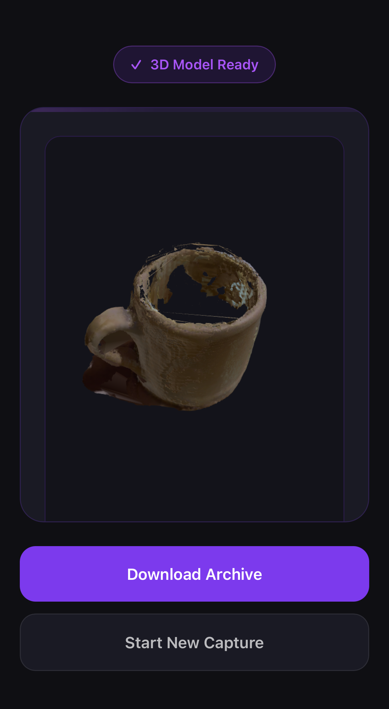<br/><sub><b>3 · Result</b> · frontend<br/>The reconstructed 3D object is returned to the app</sub></td>
  </tr>
</table>

### 6.2 Execution Flow

VGGT-Ω inference and segmentation run **in parallel** on the same input images.

> **Important:** VGGT-Ω input must include the object **with its background**. The background provides essential geometric context for accurate pose estimation — cropping it out degrades reconstruction.

Once **VGGT-Ω inference** finishes, we apply **Option C: post-inference mask filtering** — the segmentation mask zeroes the **depth confidence** of every non-object pixel (`C' = C · M`), so that when the masked depth is unprojected only object pixels ever become 3D points. The resulting **object-only** point cloud is then converted to a mesh via PyMeshLab.

```
                  ┌────────────────────────┐
  input images ─▶│  VGGT-Ω (with bg)       │─▶ depth + confidence ┐
       │          └────────────────────────┘                      │
       │          ┌────────────────────────┐                      ▼
       └────────▶│  Segmentation           │─▶ binary mask ─────▶ mask filter ─▶ unprojection ─▶ points(.ply) ─▶ mesh (.obj)
                  └────────────────────────┘
```

#### 6.2.1 The pipeline in action — one real object

Below is the exact same two-branch flow run end-to-end on a single real object: **9 smartphone shots in, a watertight mesh out.** Every image is a genuine artifact of one run (view `000` of the nine), so the walkthrough mirrors precisely what §6.2.2 and §6.2.3 describe formally.

**Input — the phone views (×9).** RGB frames at `1080×1920`, straight from the phone, **with the background kept** so VGGT-Ω has the geometric context it needs.

| Phone view (×9) |
|:---:|
| 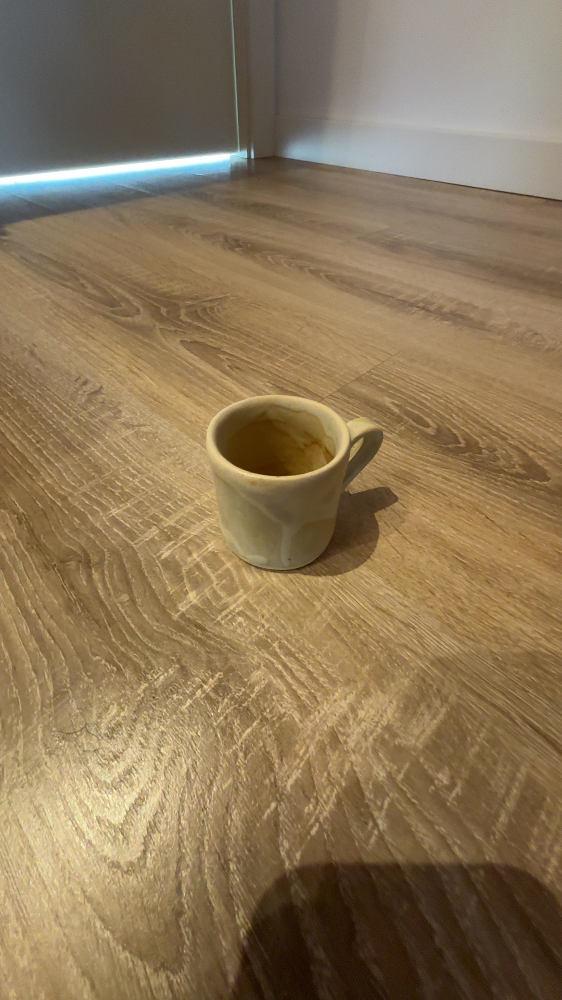 |

The nine views then fan out into the two branches that run **in parallel**:

**Depth branch — VGGT-Ω.** A single forward pass per view yields a dense **inverse depth map + per-pixel confidence** (×9).

**Segmentation branch — Approach C (selected).** For each view, YOLO26-seg produces a raw mask (with a few stray specks), which is cleaned by a **morphological opening (kernel 21)** followed by **keep-largest-component** to leave a single, crisp object mask (×9).

| VGGT-Ω depth (×9) | YOLO26-seg — raw (specks) | opening k21 → keep-largest → clean mask |
|:---:|:---:|:---:|
| 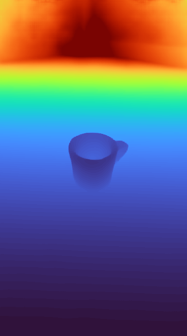 | 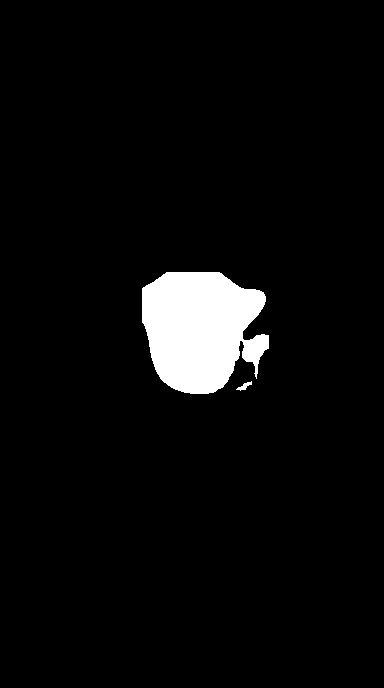 | 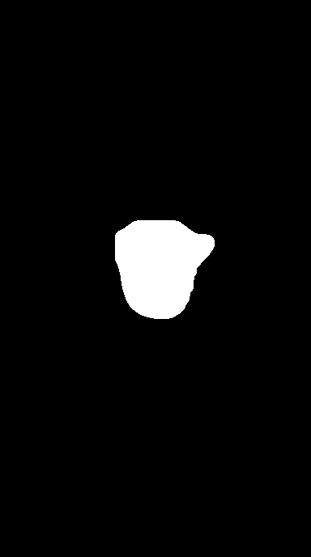 |

**Mask filter — depth × mask.** The two branches converge: the clean object mask zeroes the depth confidence everywhere outside the object (`C' = C · M`), so the depth that survives is object-only.

**Output — PyMeshLab mesh.** Unprojecting the surviving pixels across all nine views into one shared world frame gives a colored point cloud, which PyMeshLab turns into a watertight, Blender-ready mesh.

| Mask filter — confidence → 0 outside the object | Final mesh — watertight · colored · Blender-ready |
|:---:|:---:|
| 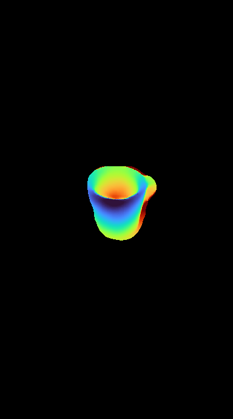 | 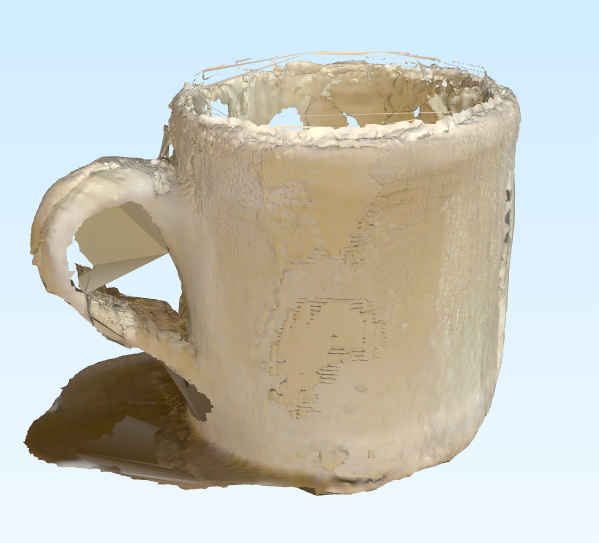 |

The unprojection step that bridges the masked depth and the mesh — pinhole back-projection then a camera→world transform, carrying per-pixel RGB, dropping flying pixels at depth edges, keeping the top confidence percentile and capping at ≤300k points before handing off to PyMeshLab — is detailed next.

#### 6.2.2 Extracting the object — fusing the mask with the scene depth

Rather than cropping the photos or trying to clean up the cloud once it's in 3D, we do all the filtering on the depth confidence that VGGT-Ω's depth head produces alongside the depth map — the per-pixel score telling us how much it trusts each depth value. With this information, we can combine the mask obtained from the segmentation module to output a cleaned version of the point cloud. 

The reason it lines up so cleanly is that we run segmentation on the very same frames VGGT-Ω sees. So the object mask `M` comes out at the same resolution as the depth map `D` and its confidence `C`, and every mask pixel sits right on top of the matching depth pixel — nothing to resize, nothing to reproject. Hence, we can now multiply the mask with the confidence for each pixel.

```
C' = C * M            # wherever the mask is 0 (background), confidence drops to 0
```

A point only makes it into the cloud if the result from the previous multiplication (C') is above zero, allowing to remove pixels that are not inside the mask. A couple of other passes write zeros into that same map: a depth-edge filter that discards the stray "flying pixels" VGGT-Ω tends to leave along object outlines, and an optional sky filter for outdoor shots. Their order doesn't matter, since all they ever do is zero pixels out. Finally, a confidence-percentile threshold (`--conf-thres`, default 20) trims whatever low-confidence pixels remain, so that we are left with the higher-confidence pixels.

Because the mask travels along inside the predictions, every way of running the pipeline — CLI, API, re-visualization — treats it exactly the same. By the end, a pixel survives only if it's both on the object and trustworthy; the background is already at zero and never turns into geometry.

#### 6.2.3 Unprojecting the object's depth into 3D

Once we know which pixels belong to the object, turning them into 3D points is textbook pinhole geometry. Each view arrives with its intrinsics `K = [fx, fy, cx, cy]` and its pose `[R | t]` from VGGT-Ω's camera head. For a pixel `(u, v)` at depth `d`, we first place it in that camera's own coordinate frame and then move it into a shared world frame (the code lives in `unproject_depth_map_to_point_map`, `vggt_omega/visualize_predictions.py`):

```
# 1) pixel + depth  ->  point in the camera's own frame
x_cam = (u - cx) / fx * d
y_cam = (v - cy) / fy * d
z_cam = d

# 2) camera frame  ->  shared world frame
#    (extrinsics map world->camera, so we invert with Rᵀ)
X_world = Rᵀ · ( [x_cam, y_cam, z_cam]ᵀ − t )
```

We carry each pixel's RGB colour over to its point, so the cloud keeps the object's real appearance. Repeat this for every surviving pixel across every view and the points all land in the same world frame and overlap cleanly — not by luck, but because VGGT-Ω solved for one consistent geometry over the whole set instead of posing each image on its own. And since the background pixels were already zeroed back in §6.2.2, none of them contribute points. What's left is just the object, ready to hand off to PyMeshLab.

---

## 7. Repository Structure

```
Final-Project-Snap-3D/
├── data/                          # VizWiz dataset (not tracked)
│   ├── train/ val/ test/          # RGB images
│   └── annotations/               # VizWiz_SOD_{train,val,test}_challenge.json
├── src/                           # Segmentation
│   ├── dataset.py                 # VizWiz Dataset (polygon → mask)
│   ├── augmentation.py            # Albumentations train / val_test pipelines
│   ├── data_visualization.py      # Inspect dataset samples (original + augmented)
│   ├── model.py                   # UNet + U²-Net architectures
│   ├── losses.py                  # BCEDiceLoss
│   ├── main.py                    # Training loop (UNet/U²-Net) + metrics + W&B
│   ├── train_yolo.py              # YOLO26-seg training (+ W&B callbacks)
│   ├── convert_vizwiz_to_yolo.py  # VizWiz JSON → YOLO format
│   ├── inference.py               # Unified UNet / U²-Net / YOLO inference
│   ├── test_evaluation.py         # IoU / Dice / precision / recall
│   ├── wandb_logger.py            # W&B logging + checkpoints
│   └── utils.py                   # TaskType enum
├── vggt_omega/                    # 3D reconstruction + API
│   ├── inference_vggt.py          # VGGT-Ω inference + segmentation
│   ├── segmentation.py            # Mask generation (YOLO / U²-Net / AND)
│   ├── visualize_predictions.py   # point cloud / mesh / depth export
│   ├── visual_util.py             # predictions_to_point_cloud
│   ├── models/  utils/            # VGGTOmega model + helpers
│   └── api/                       # FastAPI (main.py, constants.py, API_SPEC.md)
├── tools/
│   ├── debug_mesh.py              # to test point cloud → mesh (Poisson / PyMeshLab)
│   └── render_preview.py          # quick PNG preview of the point cloud
├── checkpoints/                   # model weights (not tracked)
├── inference_test/                # sample input images + generated outputs
├── requirements.txt
└── README.md
```

---

## 8. How to Run

**Prerequisites**

- Python 3.10+
- **CUDA GPU** (required for VGGT-Ω; the point-cloud→mesh step runs on CPU)
- Tested with PyTorch 2.6 + CUDA 12.6

**Installation**

```bash
git clone https://github.com/Final-Project-Snap-3D/SegmentationModel_PP_AI.git
cd SegmentationModel_PP_AI
python -m venv venv
source venv/bin/activate          # Windows: venv\Scripts\activate
pip install -r requirements.txt
```

If PyTorch does not detect your GPU (`torch.cuda.is_available()` returns `False`), reinstall it with CUDA support:

```bash
pip uninstall torch torchvision -y
pip install torch torchvision --index-url https://download.pytorch.org/whl/cu126
```

Download the VizWiz dataset into `data/` and place the model checkpoints in `checkpoints/` (`vggt_omega_1b_512.pt`, the fine-tuned YOLO/U²-Net segmentation weights). Inspect dataset samples (original and augmented) with `python src/data_visualization.py`.

**Train segmentation**

```bash
# U²-Net (default). Use --model_name U to train the UNet baseline instead.
python src/main.py --image_size 512 --batch_size 16 --epochs 100 --lr 1e-3

# Resume an interrupted training from the last checkpoint
python src/main.py --resume checkpoints/last.pt --epochs 100

# Smoke-test the loop on a handful of samples (data/one_image_{train,val})
python src/main.py --batch_size 1 \
  --train_images_dir data/one_image_train --val_images_dir data/one_image_val

# YOLO26-seg — one-time conversion, then train (defaults: yolo26s-seg, imgsz 512, batch 4, AMP)
python src/convert_vizwiz_to_yolo.py
python src/train_yolo.py --epochs 100
```

Training logs (losses, IoU/Dice, validation overlays) go to **Weights & Biases**; checkpoints are stored in `checkpoints/` (`best_model.pt`, `last.pt`, `final_model.pt`).

**Evaluate a segmentation checkpoint**

```bash
python src/test_evaluation.py --model_path checkpoints/best_model.pt \
  --images_dir data/test --annotations data/annotations/VizWiz_SOD_test_challenge.json
```

**Run the pipeline (CLI)**

```bash
pip install -r vggt_omega/requirements.txt

# 1) VGGT-Ω + segmentation → predictions (needs GPU). HEIC/HEIF phone photos supported.
python -m vggt_omega.inference_vggt \
  -c checkpoints/vggt_omega_1b_512.pt \
  -i inference_test/images/*.jpg \
  --seg-checkpoint checkpoints/best_yolo.pt \
  --morph-open --keep-largest \
  --mask-dir masks \
  -o inference_test/outputs/predictions.pt

# 2) point cloud → watertight mesh with PyMeshLab (no GPU needed)
python tools/debug_mesh.py \
  --predictions inference_test/outputs/predictions.pt \
  --output inference_test/outputs/scene.obj --method pymeshlab
```

To export just the segmented **point cloud** (no mesh), point `-o` at a `.ply` file instead of `predictions.pt` — the format is inferred from the extension.

**Run the API**

```bash
pip install -r vggt_omega/api/requirements.txt
export VGGT_CHECKPOINT=checkpoints/vggt_omega_1b_512.pt
export VGGT_SEG_CHECKPOINT=checkpoints/best_yolo.pt
export VGGT_DEVICE=cuda
uvicorn vggt_omega.api.main:app --host 0.0.0.0 --port 8000
```

Then open `http://localhost:8000/docs` (Swagger UI) or use curl:

```bash
curl -X POST http://localhost:8000/api/v1/inference \
  -F "images=@img1.jpg" -F "images=@img2.jpg" \
  -F "export_format=mesh" -F "mesh_format=obj" -F "segment=true"
# → returns a job_id; download with:
curl -OJ http://localhost:8000/api/v1/jobs/<job_id>/files/scene.obj
```

Key environment variables (`vggt_omega/api/constants.py`):

| Variable | Default | Description |
|----------|---------|-------------|
| `VGGT_CHECKPOINT` | `checkpoints/vggt_omega_1b_512.pt` | VGGT-Ω checkpoint (required) |
| `VGGT_SEG_CHECKPOINT` | `checkpoints/best_yolo.pt` | Segmentation checkpoint |
| `VGGT_DEVICE` | `cuda` | Inference device |
| `VGGT_OUTPUT_DIR` | `api_outputs` | Per-job artifacts directory |

---

## 9. Summary of Key Decisions

| Decision | Rationale |
|---|---|
| YOLO26-seg as final segmenter (over our own UNet/U²-Net) | Better mask quality and inference; U²-Net kept as an alternative and mixed AND mode |
| Approach C — YOLO + morphological opening + keep-largest | Sharp boundaries with residual noise removed, object not eroded (vs AND-erosion or soft U²-Net edges) |
| VGGT-Ω over COLMAP / SfM | Feed-forward single pass, robust on few casual phone photos; no iterative matching or bundle adjustment |
| Apply the mask through `depth_conf` (conf = 0 on background) | One filtering mechanism shared by mask, confidence and depth-edge filters; mask travels inside the predictions dict |
| Post-inference mask filtering (Option C), background kept for VGGT | Background is required context for pose estimation; the object is isolated only after reconstruction |
| PyMeshLab (Screened Poisson) over Open3D Poisson / NKSR | Poisson artifacts on few-view clouds; NKSR not integrable (expired wheels, source build); PyMeshLab clean and scriptable |
| Points-only PLY export (previously GLB with camera frustums) | The output is the object's cloud for meshing, not a debug scene |
| Multipart FastAPI service behind a single-GPU lock | Decouples the mobile app from the GPU server; serializes inference on shared hardware |

---

## 10. Conclusions & Future Work

Snap-to-3D delivers a working end-to-end path from casual smartphone photos to editable, printable 3D meshes, combining a robust segmentation front-end (YOLO + morphological opening) with a modern feed-forward reconstruction backbone (VGGT-Ω) and a scriptable meshing stage (PyMeshLab).

**What we learned along the way:** simple baselines fell short — UNet from scratch and Poisson reconstruction both underperformed, and NKSR proved impractical to integrate given its expired wheels and source-build requirements. Each dead end sharpened the final design.

**Limitations**

- Reconstruction quality depends on view coverage and object texture; few-view captures leave holes on unseen faces.
- Thin or reflective surfaces remain challenging.
- Segmentation with the fine-tuned YOLO is limited to the salient object; heavily cluttered scenes can confuse it.

**Future work**

- **Unified segmentation metrics.** Evaluate all models at a matched operating point (precision–recall curves / threshold sweep, consistent instance-mask merging) so Precision and Recall are directly comparable across UNet, U²-Net and YOLO — and log the missing UNet values (see the note under §4.1).
- Revisit learned meshing once tooling matures.
- Tighter mask/point-cloud fusion (evaluate in-loop vs post-inference filtering).
- Metric-scale calibration for print-accurate dimensions.
- Latency optimization for interactive, on-device capture.

---