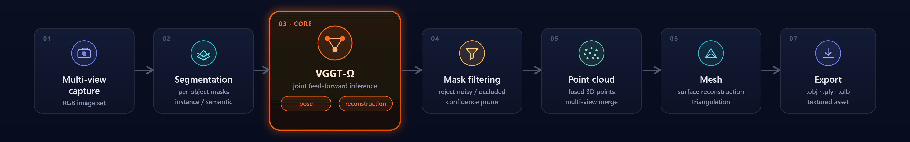
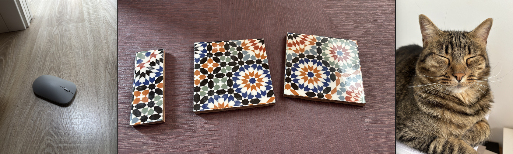
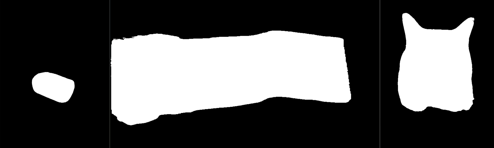
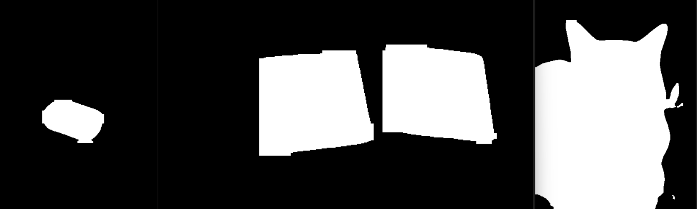
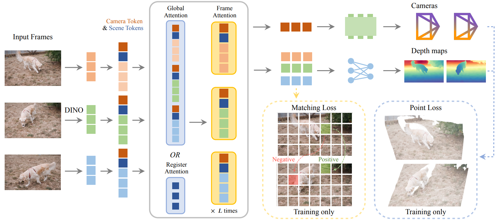

# Snap-to-3D: Multi-View Object Reconstruction from Smartphone Images

> Final project — Postgraduate course on **Artificial Intelligence with Deep Learning**, UPC School (2026).
> **Authors:** Maria Bertolín · Marc Borràs · Marc Castellana · Gerard Rosell
> **Advisor:** Pablo Vega
> **Repository:** https://github.com/Final-Project-Snap-3D

---

## Table of Contents

1. [Introduction & Motivation](#1-introduction--motivation)
2. [Pipeline Overview](#2-pipeline-overview)
3. [Dataset](#3-dataset)
4. [Segmentation](#4-segmentation)
5. [3D Reconstruction](#5-3d-reconstruction)
6. [End-to-End System](#6-end-to-end-system)
7. [Repository Structure](#7-repository-structure)
8. [How to Run](#8-how-to-run)
9. [Summary of Key Decisions](#9-summary-of-key-decisions)
10. [Conclusions & Future Work](#10-conclusions--future-work)

---

## 1. Introduction & Motivation

Snap-to-3D is an end-to-end pipeline that turns a handful of casual smartphone photos of a real-world object into a **Blender-ready, editable, 3D-printable mesh** (`.obj` / `.ply` / `.stl`). No turntable, no scanner, no calibration rig — just a few shots taken from different angles.

The goal is to make 3D asset creation accessible to anyone with a phone. Concrete applications:

- **E-commerce** — generate 3D product views from a quick photo session.
- **Digital twins** — capture physical assets for simulation or inventory.
- **Cultural heritage** — digitize objects for preservation and study.
- **3D printing** — produce watertight meshes ready to slice and print.

---

## 2. Pipeline Overview



At a high level, input images follow two parallel branches — **segmentation** (to isolate the object) and **VGGT-Ω** (to recover camera poses and a dense point cloud). The segmentation masks then filter the reconstructed point cloud, which is finally meshed and exported.

```
Smartphone photos (N views)
        │
        ├───────────────► Segmentation     ──────────► binary masks  ─┐
        │                 (YOLO / U²-Net)                             │
        │                                                             ▼
        └───────────────► VGGT-Ω ─► poses + dense point cloud ─► mask filter ─► PyMeshLab ─► .obj/.ply
                          (full RGB, background kept)          
```

---

## 3. Dataset

We train the segmentation stage on **[VizWiz](https://vizwiz.org/tasks-and-datasets/salient-object-detection/)**, a dataset of photos taken by blind and low-vision users. The images are *real-world mobile captures* — noisy, with diverse lighting, cluttered backgrounds, motion blur, and off-center framing — which matches the conditions our pipeline must handle far better than clean studio datasets.

Annotations are provided as one JSON per split (`VizWiz_SOD_{train,val,test}_challenge.json`), where each entry gives the ground-truth image dimensions and a list of `Salient Object` polygons. Polygons are rasterized into binary masks with `cv2.fillPoly`; images without a valid annotation are filtered out automatically.

```json
"VizWiz_train_00000000.jpg": {
    "Full Screen": false,
    "Total Polygons": 1,
    "Ground Truth Dimensions": [H, W],
    "Salient Object": [[[x1, y1], [x2, y2], ...]]
}
```

The split is **not** produced by our code (no random split): we use the official VizWiz SOD train/val/test challenge splits directly, defined by the three JSON files above and their matching `data/{train,val,test}` image folders.

| Split | Images |
|-------|--------|
| Train | 19.116|
| Val   | 6.105 |
| Test  | 6.779 |
| **Total** | 32000 |


---

## 4. Segmentation

### 4.1 Models

We iterated through three architectures.

**1. UNet from scratch.** Trained on VizWiz with a combined `BCEDiceLoss` (0.3 BCE + 0.7 Dice), `AdamW` optimizer (lr `1e-3`), 512×512 inputs, and Albumentations augmentation (horizontal flip, rotations, shift-scale-rotate, brightness/contrast, hue/saturation, blur, noise). BatchNorm was added between Conv and ReLU to stabilize training from zero. Training began on Google CLI but was too slow, so we migrated to UPC servers. **Results were not satisfactory** — masks were imprecise and unstable.

**2. U²-Net.** Switching to the U²-Net architecture (nested RSU blocks with deep supervision over 6 side outputs) produced a **dramatic improvement** over UNet. Object boundaries were far cleaner, though some segmentation errors remained. This is the default model in `src/main.py` (`--model_name U2`).

**3. YOLO (Ultralytics YOLO26-seg).** With limited time and team resources, we fine-tuned YOLO26-seg on VizWiz (single class `salient_object`) for instance segmentation. Results were **cleaner** and more robust on our target images.

> Note: Segmentation must use the **VizWiz-fine-tuned** YOLO checkpoint produced by `src/train_yolo.py`.

Metrics on the **VizWiz SOD test split** (`VizWiz_SOD_test_challenge.json`), pixel-level, same evaluation script (`src/test_evaluation.py`); binarization threshold 0.5 for UNet/U²-Net, YOLO confidence 0.25.

| Model | IoU | Dice | Precision | Recall |
|-------|-----|------|-----------|--------|
| UNet (scratch) | <!-- TODO --> | <!-- TODO --> | <!-- TODO --> | <!-- TODO --> |
| U²-Net | 0.7765 | 0.8397 | 0.8366 | 0.8987 |
| **YOLO26-seg (fine-tuned)** | **0.8866** | **0.9206** | **0.9057** | **0.9584** |

YOLO26-seg wins on every metric (+0.110 IoU / +14.2 %, +0.081 Dice over U²-Net) — hence our final segmenter, with U²-Net kept as the baseline. Both models keep recall above precision, i.e. they slightly over-segment (include a little background rather than dropping object pixels) — the preferable failure mode for the VizWiz use case.

Images: 
Masks with U2Net: 
Masks with YOLO: 

### 4.2 Mask Refinement

Both YOLO and U²-Net locate the object reliably, but they fail in different ways: YOLO occasionally adds **spurious secondary detections** (other objects in the scene), while U²-Net produces **soft, blob-like boundaries** with small holes and specks. Refinement removes this noise *before* the mask filters the point cloud, so background geometry doesn't leak into the final mesh.

Our segmentation module (`vggt_omega/segmentation.py`) provides a toolbox that can be combined:

- **AND combination (mixed mode).** Element-wise AND of the YOLO and U²-Net binary masks — a pixel is kept only if *both* models agree it is foreground. This cancels each model's false positives, but erodes the object wherever the two disagree.
- **Morphological opening** (`--morph-open`; elliptical kernel, `--morph-kernel`, default 21). Erosion followed by dilation: removes small noise regions and thin bridges while leaving the main compact object intact.
- **Keep-largest component** (`--keep-largest`). Connected-component analysis (8-connectivity) that keeps only the largest region per frame, discarding secondary detections (e.g. a background object caught alongside the target).

We compared three refinement approaches on the same captures:

| Approach | What it does | Result |
|----------|--------------|--------|
| **A** — YOLO ∩ U²-Net (AND) | Intersect both masks | Removes false positives, but erodes edges where the two models disagree |
| **B** — U²-Net + opening | Saliency mask cleaned with morphological opening | Clean silhouette, but softer / less precise boundaries |
| **C** — YOLO + opening | Detection mask cleaned with morphological opening | **Selected** — sharp boundaries, residual noise removed, object not eroded |

<!-- TODO: side-by-side comparison image of approaches A vs B vs C on the same object -->
<!-- TODO: for each approach, show: input photo → raw mask → refined mask (overlay on the photo) -->

The chosen configuration is **Approach C** (`--seg-checkpoint <yolo_vizwiz>.pt --morph-open --keep-largest`).

---

## 5. 3D Reconstruction

### 5.1 VGGT-Ω

For pose estimation and reconstruction we use [**VGGT-Ω** (CVPR 2026, VGG Oxford + Meta AI)](https://vggt-omega.github.io), a feed-forward transformer that recovers camera geometry and dense 3D **in a single forward pass** — no iterative feature matching and no bundle adjustment. We chose it over **COLMAP** because incremental SfM is slow, brittle on sparse or textureless captures, and often fails on casual phone photos; VGGT-Ω stays robust even with very few views.

**General input / output**

- **Input:** N RGB images of the object *with their background* (JPG/PNG and phone **HEIC/HEIF** via `pillow-heif`; preprocessed to `(N, 3, H, W)`, resolution 512; mixed portrait/landscape is padded to a common size). The background is required — it gives the geometric context the model needs for pose estimation.
- **Output:** for each view, camera **extrinsics** (rotation + translation) and **intrinsics** (`K`), a dense **depth map** and a per-pixel **confidence**; from these, a fused dense **point cloud** in world coordinates.

**How it works — stage by stage**

| # | Stage | Input | Output |
|---|-------|-------|--------|
| 1 | **Image tokenizer** (DINOv3 `patch_embed`) | `(N,3,H,W)` RGB images | Patch tokens per image |
| 2 | **Aggregator** — alternating **frame-wise** and **global cross-view** attention, with learned **camera** and **register** tokens | Patch tokens + camera/register tokens | Context-aware tokens shared across all views (`camera_and_register_tokens` + patch features) |
| 3 | **Camera head** | Camera tokens | Pose encoding → **extrinsics** + **intrinsics** per view |
| 4 | **Depth head** | Aggregated patch features | Dense **depth map** + **depth confidence** per view |
| 5 | **Unprojection** (post-processing) | Depth + intrinsics + extrinsics | **3D point cloud** in world coordinates, confidence-filtered |

The core idea is the **alternating attention** in the aggregator: frame-wise attention refines each image on its own, while global attention lets all views exchange information, so the model settles on a single consistent geometry and camera set instead of solving each image independently. The **camera tokens** specialize in recovering pose, and the **register tokens** absorb global context that stabilizes the features. The **depth confidence** from stage 4 is later used to drop unreliable points before meshing (and is where the segmentation mask is applied — Option C, see §6.2).

> ⚠️ VGGT-Ω requires a **CUDA GPU** 



### 5.2 Point Cloud to Mesh

Converting the VGGT-Ω point cloud into a usable surface also went through several iterations:

**1. Poisson Surface Reconstruction.** Classical, no learning (via Open3D). Simple to run but **poor quality** on few-view clouds — over-smoothed surfaces, "bubble"/membrane artifacts where the unseen back is extrapolated, and stray spikes from outliers. It remains available as a baseline (`--method poisson`), improved with adaptive normals, statistical outlier removal, and optional hole-filling.

**2. NKSR.** Neural Kernel Surface Reconstruction looked promising (class-agnostic, learning-based), but we **could not integrate it** within our timeframe: the prebuilt wheels had expired and the remaining path required compiling CUDA extensions from source against our exact torch/CUDA versions.

**3. PyMeshLab.** Our **final choice**. It offers a scriptable, reproducible meshing pipeline (Screened Poisson + reliable cleaning and normal handling), producing watertight meshes without the artifacts of Open3D Poisson alone, and installs cleanly with no CUDA build step.

| Method | Learning | Outcome |
|--------|----------|---------|
| Poisson (Open3D) | No | Baseline — artifacts on few-view clouds |
| NKSR | Yes | Not integrable in time (expired wheels, source build) |
| **PyMeshLab (Screened Poisson)** | No | **Selected — robust, scriptable, clean install** |

**Input:** point cloud from VGGT-Ω. **Output:** watertight `.obj` / `.ply` mesh.

---

## 6. End-to-End System

### 6.1 API Architecture

Inference is served through a **FastAPI** application (`vggt_omega/api/main.py`) that exposes the pipeline as an HTTP service. Full spec in [`vggt_omega/api/API_SPEC.md`](vggt_omega/api/API_SPEC.md).

Endpoints:

| Method & path | Purpose |
|---------------|---------|
| `POST /api/v1/inference` | Upload N images and run the pipeline; returns job metadata + artifact download URLs |
| `GET /api/v1/jobs/{job_id}/files/{path}` | Download a single artifact (mesh, point cloud, depth/mask PNG) |
| `GET /api/v1/jobs/{job_id}/archive` | Download all artifacts of a job as a ZIP |
| `GET /health` | Device, CUDA and checkpoint availability |
| `GET /docs` | Interactive Swagger UI |

The `inference` endpoint accepts (multipart form): `images[]`, `export_format` (`mesh`/`points`), `mesh_format` (`obj`/`stl`/`ply`), `segment`, `seg_conf`, `export_depth`, `export_masks`, plus preprocessing knobs (`resolution`, `mode`, `conf_thres`, `poisson_depth`). It returns a JSON with `job_id`, `num_images`, `device`, tensor `shapes`, an `artifacts` list and an `archive_url`. Inference is serialized behind a lock (single shared GPU); uploads are limited to 32 images / 25 MB each, and the service returns `503` on CPU-only hosts.

Configuration is environment-driven (`vggt_omega/api/constants.py`): checkpoints are looked up in `checkpoints/` first, then the repo root.

**Mobile application.** The API is consumed by a mobile client: the user photographs the object from several angles, the app posts the images to `POST /api/v1/inference`, and receives the reconstructed 3D object (point cloud / mesh) as the result. The multipart service decouples the app from the GPU server, so all heavy inference stays server-side.

### 6.2 Execution Flow

VGGT-Ω inference and segmentation run **in parallel** on the same input images.

> **Important:** VGGT-Ω input must include the object **with its background**. The background provides essential geometric context for accurate pose estimation — cropping it out degrades reconstruction.

Once reconstruction finishes, we apply **Option C: post-inference mask filtering** — the segmentation mask zeroes the confidence of non-object pixels, filtering the reconstructed point cloud down to the object. The filtered point cloud is then converted to a mesh via PyMeshLab.

```
                  ┌────────────────────────┐
  input images ─▶│  VGGT-Ω (with bg)       │─▶ point cloud ┐
       │          └────────────────────────┘                │
       │          ┌────────────────────────┐                ▼
       └────────▶│  Segmentation           │─▶ mask ─▶ filter ─▶ points(.ply) ─▶ mesh (.obj)
                  └────────────────────────┘
```

---

## 7. Repository Structure

```
Final-Project-Snap-3D/
├── data/                          # VizWiz dataset (not tracked)
│   ├── train/ val/ test/          # RGB images
│   └── annotations/               # VizWiz_SOD_{train,val,test}_challenge.json
├── src/                           # Segmentation
│   ├── dataset.py                 # VizWiz Dataset (polygon → mask)
│   ├── augmentation.py            # Albumentations train / val_test pipelines
│   ├── model.py                   # UNet + U²-Net architectures
│   ├── losses.py                  # BCEDiceLoss
│   ├── main.py                    # Training loop (UNet/U²-Net) + metrics + W&B
│   ├── train_yolo.py              # YOLO26-seg training (+ W&B callbacks)
│   ├── convert_vizwiz_to_yolo.py  # VizWiz JSON → YOLO format
│   ├── inference.py               # Unified UNet / U²-Net / YOLO inference
│   ├── test_evaluation.py         # IoU / Dice / precision / recall
│   ├── wandb_logger.py            # W&B logging + checkpoints
│   └── utils.py                   # TaskType enum
├── vggt_omega/                    # 3D reconstruction + API
│   ├── inference_vggt.py          # VGGT-Ω inference + segmentation
│   ├── segmentation.py            # Mask generation (YOLO / U²-Net / AND)
│   ├── visualize_predictions.py   # point cloud / mesh / depth export
│   ├── visual_util.py             # predictions_to_point_cloud
│   ├── models/  utils/            # VGGTOmega model + helpers
│   └── api/                       # FastAPI (main.py, constants.py, API_SPEC.md)
├── tools/
│   ├── debug_mesh.py              # to test point cloud → mesh (Poisson / PyMeshLab)
│   └── render_preview.py          # quick PNG preview of the point cloud
├── checkpoints/                   # model weights (not tracked)
├── inference_test/                # sample input images + generated outputs
├── requirements.txt
└── README.md
```

---

## 8. How to Run

**Prerequisites**

- Python 3.10+
- **CUDA GPU** (required for VGGT-Ω; the point-cloud→mesh step runs on CPU)
- Tested with PyTorch 2.6 + CUDA 12.6

**Installation**

```bash
git clone https://github.com/Final-Project-Snap-3D/SegmentationModel_PP_AI.git
cd SegmentationModel_PP_AI
python -m venv venv
source venv/bin/activate          # Windows: venv\Scripts\activate
pip install -r requirements.txt
```

If PyTorch does not detect your GPU (`torch.cuda.is_available()` returns `False`), reinstall it with CUDA support:

```bash
pip uninstall torch torchvision -y
pip install torch torchvision --index-url https://download.pytorch.org/whl/cu126
```

Download the VizWiz dataset into `data/` and place the model checkpoints in `checkpoints/` (`vggt_omega_1b_512.pt`, the fine-tuned YOLO/U²-Net segmentation weights). Inspect dataset samples (original and augmented) with `python src/data_visualization.py`.

**Train segmentation**

```bash
# U²-Net (default). Use --model_name U to train the UNet baseline instead.
python src/main.py --image_size 512 --batch_size 16 --epochs 100 --lr 1e-3

# Resume an interrupted training from the last checkpoint
python src/main.py --resume checkpoints/last.pt --epochs 100

# Smoke-test the loop on a handful of samples (data/one_image_{train,val})
python src/main.py --batch_size 1 \
  --train_images_dir data/one_image_train --val_images_dir data/one_image_val

# YOLO26-seg — one-time conversion, then train (defaults: yolo26s-seg, imgsz 512, batch 4, AMP)
python src/convert_vizwiz_to_yolo.py
python src/train_yolo.py --epochs 100
```

Training logs (losses, IoU/Dice, validation overlays) go to **Weights & Biases**; checkpoints are stored in `checkpoints/` (`best_model.pt`, `last.pt`, `final_model.pt`).

**Evaluate a segmentation checkpoint**

```bash
python src/test_evaluation.py --model_path checkpoints/best_model.pt \
  --images_dir data/test --annotations data/annotations/VizWiz_SOD_test_challenge.json
```

**Run the pipeline (CLI)**

```bash
pip install -r vggt_omega/requirements.txt

# 1) VGGT-Ω + segmentation → predictions (needs GPU). HEIC/HEIF phone photos supported.
python -m vggt_omega.inference_vggt \
  -c checkpoints/vggt_omega_1b_512.pt \
  -i inference_test/images/*.jpg \
  --seg-checkpoint checkpoints/best_yolo.pt \
  --morph-open --keep-largest \
  --mask-dir masks \
  -o inference_test/outputs/predictions.pt

# 2) point cloud → watertight mesh with PyMeshLab (no GPU needed)
python tools/debug_mesh.py \
  --predictions inference_test/outputs/predictions.pt \
  --output inference_test/outputs/scene.obj --method pymeshlab
```

To export just the segmented **point cloud** (no mesh), point `-o` at a `.ply` file instead of `predictions.pt` — the format is inferred from the extension.

**Run the API**

```bash
pip install -r vggt_omega/api/requirements.txt
export VGGT_CHECKPOINT=checkpoints/vggt_omega_1b_512.pt
export VGGT_SEG_CHECKPOINT=checkpoints/best_yolo.pt
export VGGT_DEVICE=cuda
uvicorn vggt_omega.api.main:app --host 0.0.0.0 --port 8000
```

Then open `http://localhost:8000/docs` (Swagger UI) or use curl:

```bash
curl -X POST http://localhost:8000/api/v1/inference \
  -F "images=@img1.jpg" -F "images=@img2.jpg" \
  -F "export_format=mesh" -F "mesh_format=obj" -F "segment=true"
# → returns a job_id; download with:
curl -OJ http://localhost:8000/api/v1/jobs/<job_id>/files/scene.obj
```

Key environment variables (`vggt_omega/api/constants.py`):

| Variable | Default | Description |
|----------|---------|-------------|
| `VGGT_CHECKPOINT` | `checkpoints/vggt_omega_1b_512.pt` | VGGT-Ω checkpoint (required) |
| `VGGT_SEG_CHECKPOINT` | `checkpoints/yolo26s-seg.pt` | Segmentation checkpoint |
| `VGGT_DEVICE` | `cuda` | Inference device |
| `VGGT_OUTPUT_DIR` | `api_outputs` | Per-job artifacts directory |

---

## 9. Summary of Key Decisions

| Decision | Rationale |
|---|---|
| YOLO26-seg as final segmenter (over our own UNet/U²-Net) | Better mask quality and inference; U²-Net kept as an alternative and mixed AND mode |
| Approach C — YOLO + morphological opening + keep-largest | Sharp boundaries with residual noise removed, object not eroded (vs AND-erosion or soft U²-Net edges) |
| VGGT-Ω over COLMAP / SfM | Feed-forward single pass, robust on few casual phone photos; no iterative matching or bundle adjustment |
| Apply the mask through `depth_conf` (conf = 0 on background) | One filtering mechanism shared by mask, confidence and depth-edge filters; mask travels inside the predictions dict |
| Post-inference mask filtering (Option C), background kept for VGGT | Background is required context for pose estimation; the object is isolated only after reconstruction |
| PyMeshLab (Screened Poisson) over Open3D Poisson / NKSR | Poisson artifacts on few-view clouds; NKSR not integrable (expired wheels, source build); PyMeshLab clean and scriptable |
| Points-only PLY export (previously GLB with camera frustums) | The output is the object's cloud for meshing, not a debug scene |
| Multipart FastAPI service behind a single-GPU lock | Decouples the mobile app from the GPU server; serializes inference on shared hardware |

---

## 10. Conclusions & Future Work

Snap-to-3D delivers a working end-to-end path from casual smartphone photos to editable, printable 3D meshes, combining a robust segmentation front-end (YOLO + morphological opening) with a modern feed-forward reconstruction backbone (VGGT-Ω) and a scriptable meshing stage (PyMeshLab).

**What we learned along the way:** simple baselines fell short — UNet from scratch and Poisson reconstruction both underperformed, and NKSR proved impractical to integrate given its expired wheels and source-build requirements. Each dead end sharpened the final design.

**Limitations**

- Reconstruction quality depends on view coverage and object texture; few-view captures leave holes on unseen faces.
- Thin or reflective surfaces remain challenging.
- Segmentation with the fine-tuned YOLO is limited to the salient object; heavily cluttered scenes can confuse it.

**Future work**

- Revisit learned meshing once tooling matures.
- Tighter mask/point-cloud fusion (evaluate in-loop vs post-inference filtering).
- Metric-scale calibration for print-accurate dimensions.
- Latency optimization for interactive, on-device capture.

---

<!-- Remaining TODOs are figures, example images, dataset counts and the UNet metric row that depend on the team's W&B runs and captures. Everything code- and configuration-related is filled from the current source. -->
